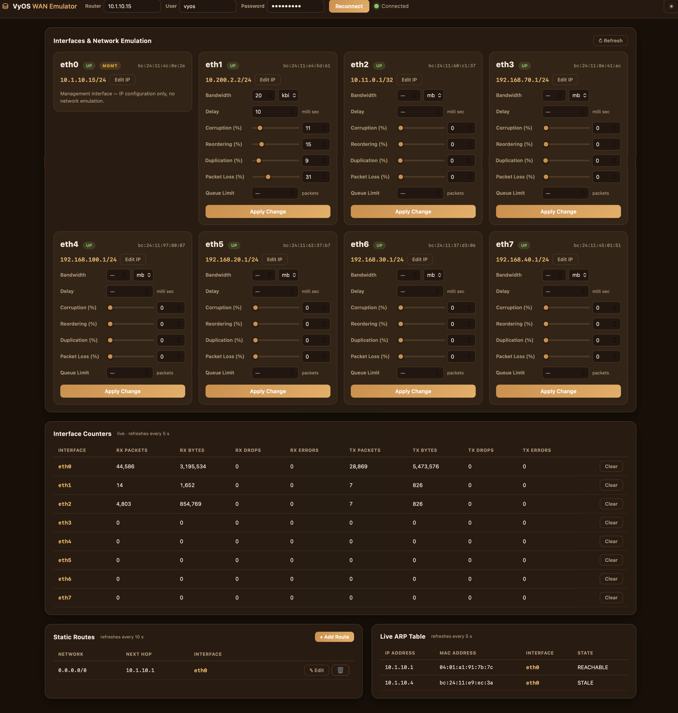
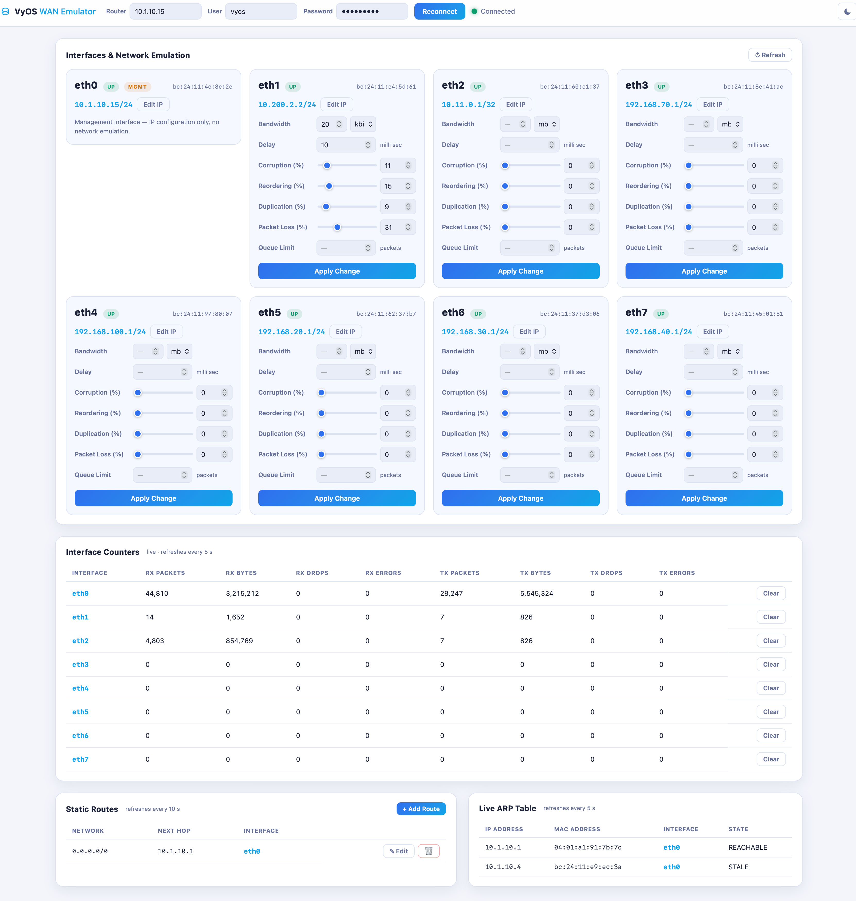

# About — VyOS WAN Emulator

## What this web app does

VyOS WAN Emulator is a single-page web application for controlling a
[VyOS](https://vyos.io) router as a WAN impairment emulator. It connects to
the router over SSH and gives you a dashboard to:

- **Emulate WAN conditions per interface** — each ethernet interface (except
  `eth0`, the management interface) gets a card with sliders and text fields
  for the VyOS `qos policy network-emulator` parameters: bandwidth, delay,
  corruption, reordering, duplication, packet loss, and queue limit. Clicking
  **Apply Change** builds the policy, binds it to the interface (egress),
  then commits **and saves** the router configuration in one ~3 second cycle.
  Clearing all fields and applying removes the emulation from that interface.
- **Configure interface IP addresses** — every card (including `eth0`) has an
  **Edit IP** dialog that replaces the interface address in CIDR form.
- **Watch live interface counters** — RX/TX packets, bytes, drops and errors,
  refreshed every 5 seconds, with a per-interface **Clear** button that runs
  `clear interfaces counters` on the router.
- **Manage static routes** — the routing table refreshes every 10 seconds and
  immediately after a change; the egress interface of each route is resolved
  live from the kernel routing table. Routes can be added, edited, and
  deleted from the page (next-hop routes, committed and saved).
- **Watch the live ARP table** — refreshed every 5 seconds.

The router IP and credentials are entered once on the page and cached in a
local `router_cache.json` file (user-only permissions), so they are prefilled
on the next visit. The UI has light and dark (earth-brown) modes.

Under the hood: a Flask backend keeps one persistent netmiko SSH session to
the router (serialized behind a lock, with automatic reconnect) and exposes a
small REST API; the frontend is dependency-free vanilla JavaScript.

## Screenshots

### Dark mode (earth brown)



### Light mode



## How to install

Requirements: Python 3.9+ and SSH reachability to a VyOS 1.4+ router.

```bash
git clone https://github.com/hackitmakeit/Vyos-Wan-Emulator.git
cd Vyos-Wan-Emulator

python3 -m venv .venv
.venv/bin/pip install -r requirements.txt

.venv/bin/python app.py
```

Then open **http://127.0.0.1:5050** in a browser, enter the VyOS router's IP
address, username and password, and click **Connect**.

> The app commits and saves configuration changes on the router. Use an
> account with configuration privileges (e.g. the `vyos` admin user), and be
> careful when editing the IP of the interface you are connected through —
> doing so drops the SSH session.

To run on a different port: `PORT=8080 .venv/bin/python app.py`.
